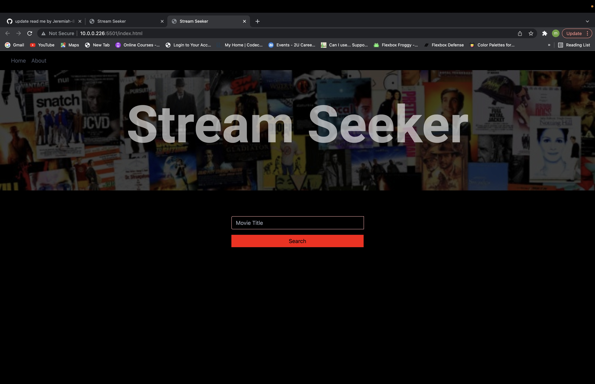
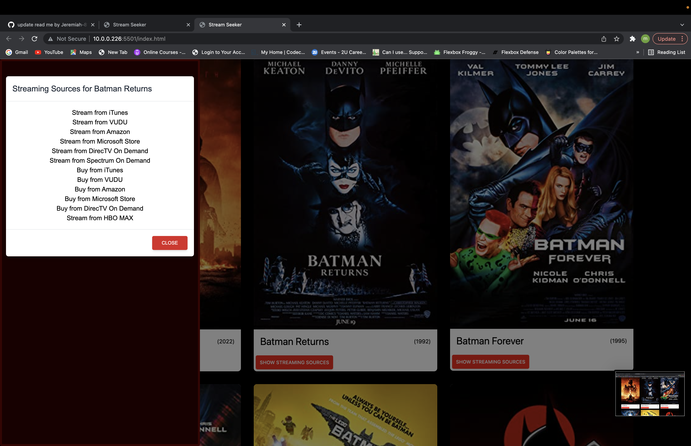

# Streaming-Project

## Description

This project uses HTML, CSS and JavaScript to query multiple APIs to retrieve data for movies and TV shows that are available to stream.

## Installation

This page is hosted at Github Pages: [https://jeremiah-81.github.io/Streaming-Project/](https://jeremiah-81.github.io/Streaming-Project/)

## Screen Shots:

*All images and graphics presented here are copyright of the respective holders. Included here under Fair Use clause of U.S. Copyright Law concerning nonprofit educational purposes. More info here: {https://www.copyright.gov/fair-use/more-info.html}(https://www.copyright.gov/fair-use/more-info.html)*

## Credits

This project used the Tailwind CSS framework:

[https://tailwindcss.com/](https://tailwindcss.com/)

The follwoing APIs were used for data sources:

[The Open Movie Database (OMDb API)](https://www.omdbapi.com/)

[Watchmode - the ultimate streaming availability metadata API. Netflix, Hulu, HBO Max, Prime Video, Disney+ &amp; over 100 more streaming services all indexed.](https://api.watchmode.com/)

## License
MIT License

Copyright (c) 2022

Permission is hereby granted, free of charge, to any person obtaining a copy
of this software and associated documentation files (the "Software"), to deal
in the Software without restriction, including without limitation the rights
to use, copy, modify, merge, publish, distribute, sublicense, and/or sell
copies of the Software, and to permit persons to whom the Software is
furnished to do so, subject to the following conditions:

The above copyright notice and this permission notice shall be included in all
copies or substantial portions of the Software.

THE SOFTWARE IS PROVIDED "AS IS", WITHOUT WARRANTY OF ANY KIND, EXPRESS OR
IMPLIED, INCLUDING BUT NOT LIMITED TO THE WARRANTIES OF MERCHANTABILITY,
FITNESS FOR A PARTICULAR PURPOSE AND NONINFRINGEMENT. IN NO EVENT SHALL THE
AUTHORS OR COPYRIGHT HOLDERS BE LIABLE FOR ANY CLAIM, DAMAGES OR OTHER
LIABILITY, WHETHER IN AN ACTION OF CONTRACT, TORT OR OTHERWISE, ARISING FROM,
OUT OF OR IN CONNECTION WITH THE SOFTWARE OR THE USE OR OTHER DEALINGS IN THE
SOFTWARE.
